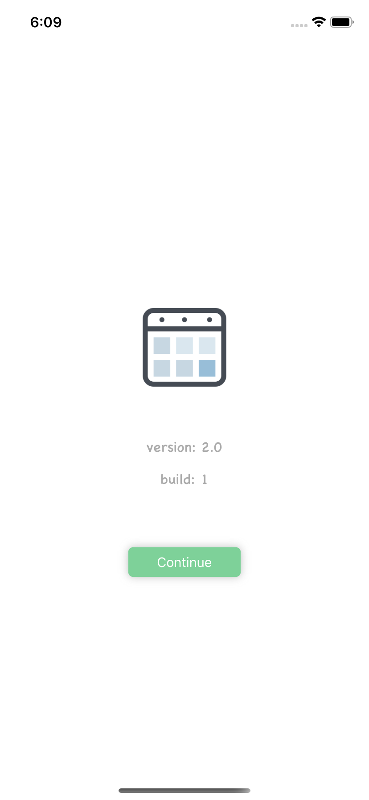
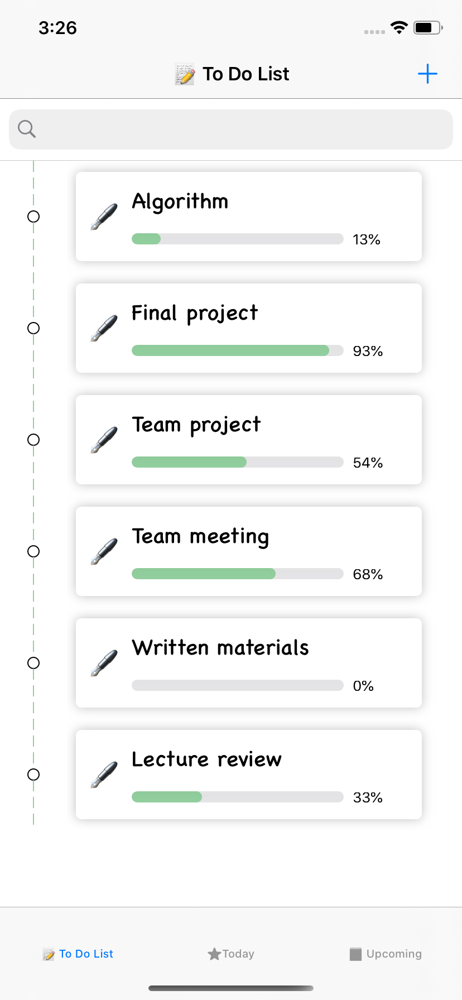
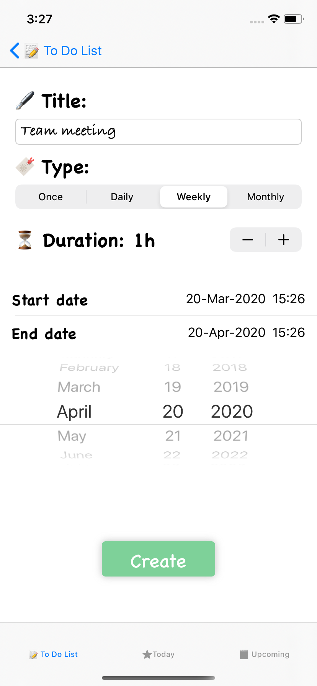
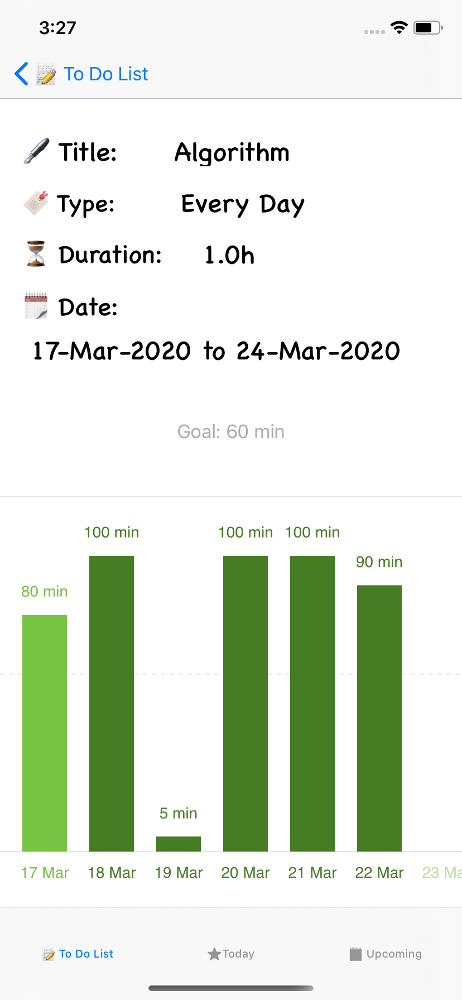
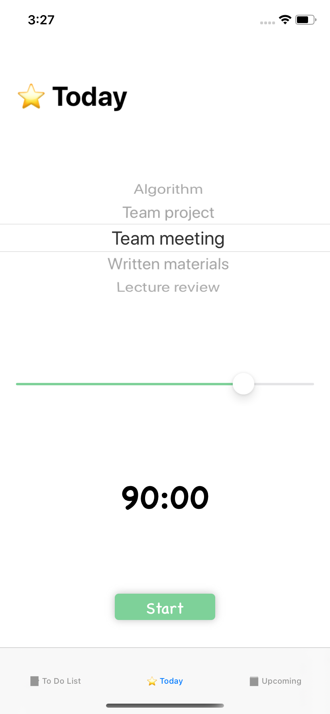
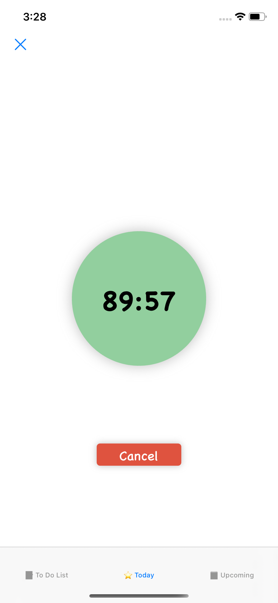
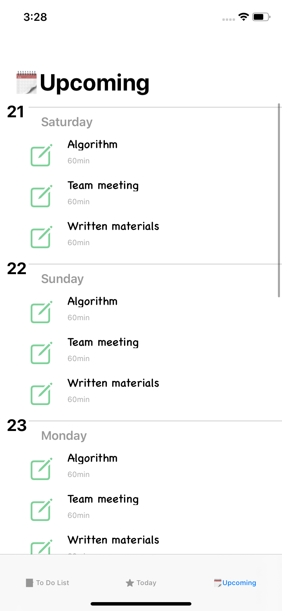

# Tasks App

## Introduction

    Get things off your mind quickly with Tasks, this is an app that helps users manage long-term tasks, keep tracking and stay   focused on them. The users can get a brief view of the statistics which shows how's the work going and where they are, the     daily check-in feature allows users to stay focused on the tasks and get the things done quickly. Also, the Upcoming view    will   remind users what tasks they have in next few days.

    Here is how Tasks works, If you are new here, this is the basic workflow:

    Collect Your Thoughts
        Get things off your mind quickly with Tasks, click the "+" button, fill in the information of the task (title, type, duration per day, start date and end date), then you will have a clear view of the tasks with progress bars to remind you how much have been done. Also, there is a search bar to help you locate the task with key word. 

    Check In Everyday
        "Today" section will show you the things need to do today. Select a task, set a time duration, click "Start" button, then just stay focused.

    Upcoming Tasks
        Check what's next. The "Upcoming" section will give you a quick view of the tasks in next 7 days.

## Screenshots

  
  
  
  

  
  
  

## References

    Icon: Handmade icon based on images coming from https://icons8.com/icon/64998/calendar

    Inline Date Picker:  https://github.com/rajtharan-g/InlineDatePicker

    Bar chart: https://github.com/nhatminh12369/BarChart/tree/master/BarChart

## Test Cases

Create a task with following parameters:

    Title: My Task
    Type: Daily
    Start Date: Today
    End Date: 20-Nov-2020

Then you will see there is a new task called "My Task" in the To Do List and Today sections, you can check the detail information by clicking the task on the to do list. Also, in the Upcoming section, the new task is already there for next 7 days.
